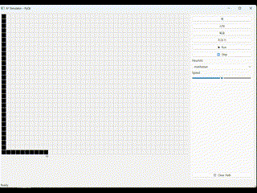
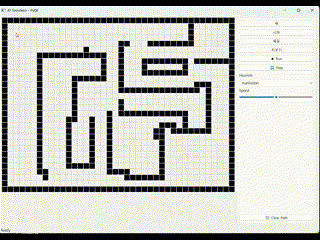
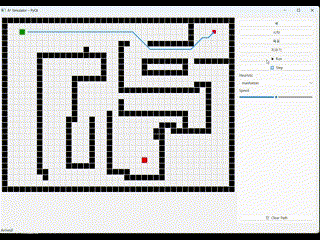

# 1. 디렉터리 구조
```bash
astarsim/
│
├─ model/
│   ├─ astar.py         # A* 알고리즘
│   ├─ grid.py          # 격자·타일 상태
│   └─ tile_consts.py   # 격자 상태 변수
│
├─ ui/
│   ├─ controller.py     # 이벤트·시뮬레이션 흐름
│   └─ pyqt_view.py    # 화면 그리기만 담당
│
└─ main.py               # 진입점

```

# 2. 시작하기

### 의존성
```bash
pip install -r requirements.txt
```

### 실행
```bash
python main.py
```

# 3. 주요 기능
### 1. 벽 그리기


### 2. 시뮬레이션1


### 3. 시뮬레이션2



# 4. 업데이트

#### 4-1.  <a ref="https://velog.io/write?id=eb5b7519-ef1d-4f3a-9f8d-3c6eec2f160e"> version 0.1 </a>
